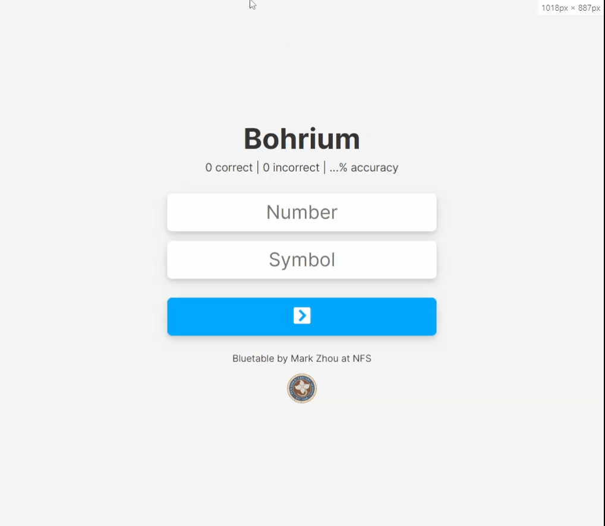

# Bluetable 

Bluetable is a simple and (hopefully) efficient way to study the periodic table!

I created Bluetable since I'm getting a science exam in a few days, and wanted to make a site to help my classmates and I practice.

## Screen Capture

## License

Bluetable is listed under the MIT license, so you can copy, distribute, or do pretty much whatever you want with it!
